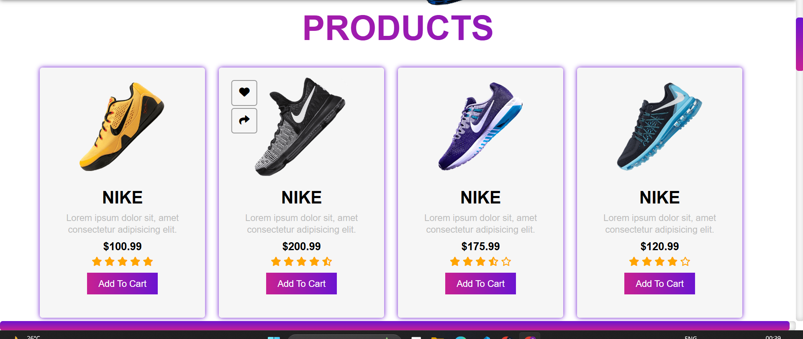
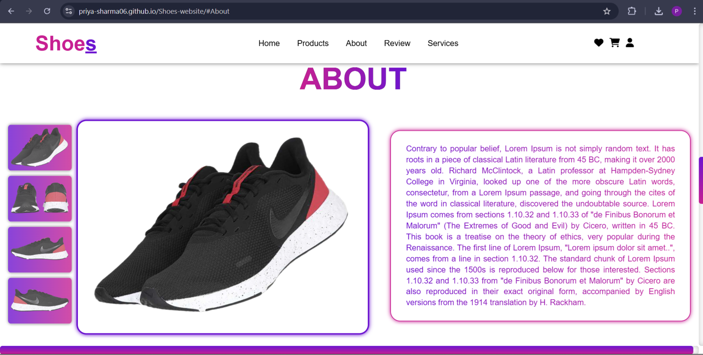
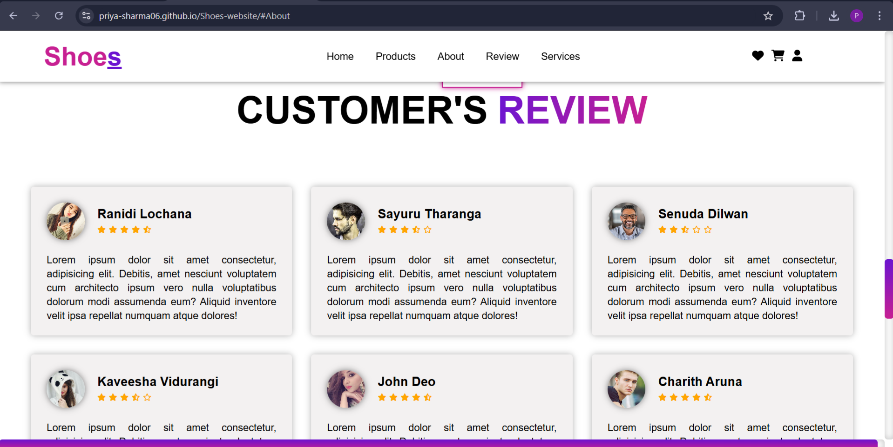
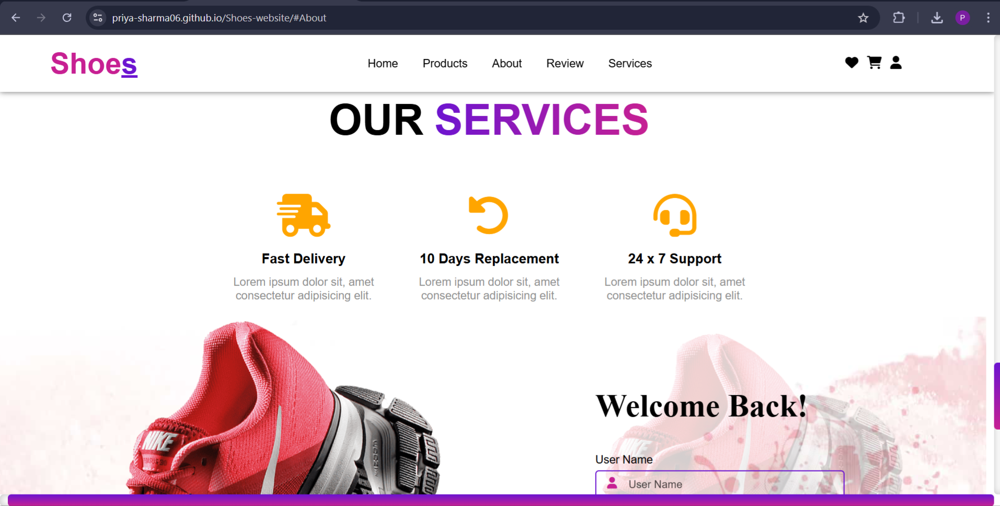
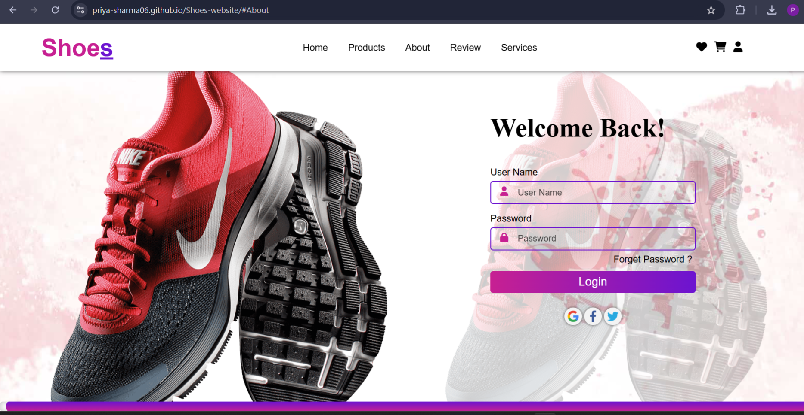
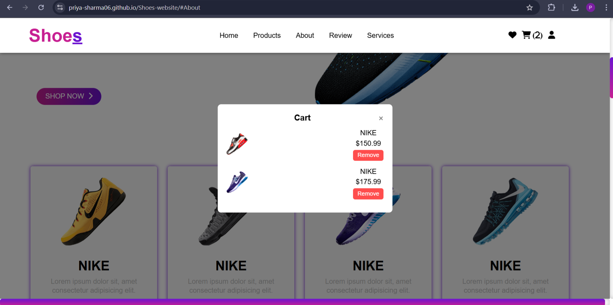
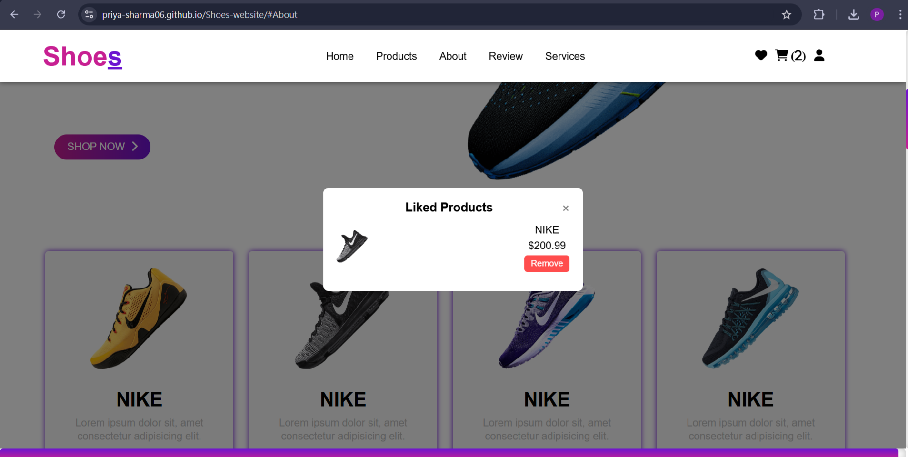

# 👟 Shoes Website

A modern and responsive **E-Commerce Shoes Website** that allows users to browse shoes, view product details, add items to a cart, and save products to a wishlist.

The website also includes sections for **customer reviews, services, and a login interface**, providing a complete front-end shopping experience.

Built using **HTML, CSS, and JavaScript**, this project demonstrates UI design, responsive layouts, and interactive web functionality commonly used in real-world e-commerce platforms.

---

## 🔗 Live Demo

🌐 https://priya-sharma06.github.io/Shoes-website/

---

## 🚀 Features

### 🛍️ Product Showcase
- Displays multiple shoe products with price and ratings
- Users can add items directly to the cart
- Clean product card layout

### ❤️ Wishlist / Liked Products
- Users can like products
- Saved products appear in the liked products popup

### 🛒 Shopping Cart
- Add products to the cart
- View cart items in a popup modal
- Remove items from the cart easily

### ⭐ Customer Reviews
- Displays feedback from customers
- Includes ratings and profile images

### 🚚 Services Section
- Fast Delivery
- 10 Days Replacement
- 24×7 Customer Support

### 🔐 Login Interface
- Simple login form with username and password
- Includes social login icons

---

## 🛠️ Tech Stack

- **HTML5** – Website structure
- **CSS3** – Styling and layout
- **JavaScript** – Interactive functionality
- **Font Awesome** – Icons
- **Google Fonts** – Typography

---

## 📂 Project Structure

```bash
Shoes-website/
├── index.html
├── style.css
├── script.js
├── images/
└── README.md
```

---

## 📸 Website Preview

### 🛍️ Products Section


---

### ℹ️ About Section


---

### ⭐ Customer Reviews


---

### 🚚 Services


---

### 🔐 Login Page


---

### 🛒 Shopping Cart


---

### ❤️ Liked Products


---

## ▶️ How to Run

1. Clone the repository

```bash
git clone https://github.com/Priya-Sharma06/Shoes-website.git
```

2. Open the project folder

3. Run the project by opening index.html in your browser.

---

## 🔮 Future Improvements

1. Add backend integration with a database  
2. Implement user authentication system  
3. Add product search and filters  
4. Integrate payment gateway  
5. Improve mobile responsiveness  

---

